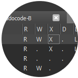

  
   
  <b>RwxMeme</b>
   
  Injector abusing RWX regions

## About
This injector abuses the fact that some signed (read whitelisted) DLLs have RWX (read, write, execute) sections. Since those sections are writable, running integrity checks towards them does not make sense, so we can simply map our own DLL into those sections.

## Usage 
Compile or download the project. Pass the process name, window title and DLL path as process arguments (run without them to get more details). Don't forget that the signed DLL will be visible in the process.